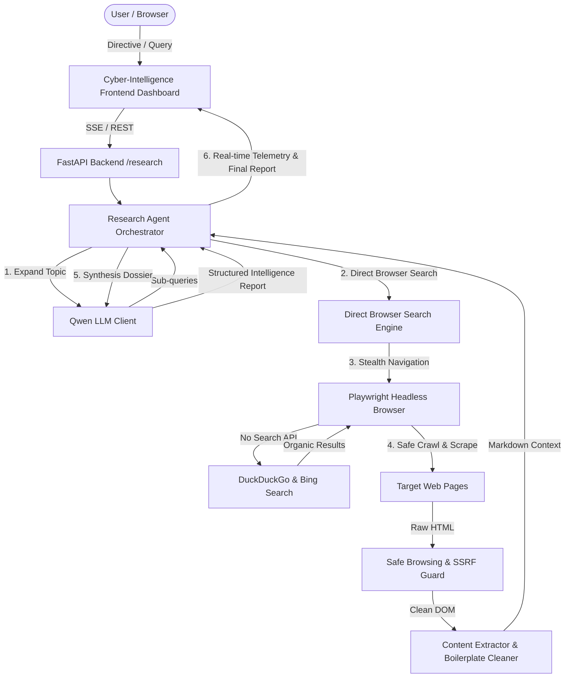

# 🌐 AI Web Research & Intelligence Agent (Zero Search API)
### ⚡ AI वेब रिसर्च एंड इंटेलिजेंस एजेंट — पूर्ण ऑटोनॉमस डीप वेब रिसर्च सिस्टम

An enterprise-grade, autonomous web research and intelligence agent that performs deep online investigations **without relying on any external commercial Search APIs** (such as Google Custom Search, Bing Web Search API, Tavily, or Serper).

It uses **Playwright** for stealthy headless browser automation and organic search queries, coupled with **Qwen LLM** (local Ollama or cloud OpenAI-compatible endpoints) for planning, cross-source reasoning, and structured Intelligence Dossier generation.

---

## 🌟 Key Highlights (प्रमुख विशेषताएं)

1. **Zero Search API (शून्य सर्च एपीआई)**:
   - किसी भी पेड सर्च एपीआई (Tavily, Serper, Google Search API) की आवश्यकता नहीं।
   - Playwright हेडलेस ब्राउज़र सीधे DuckDuckGo और Bing से ऑर्गैनिक वेब सर्च और लिंक एक्सट्रैक्शन करता है।
2. **Safe Browsing & SSRF Defense (सुरक्षित ब्राउजिंग)**:
   - सख्त SSRF प्रिवेंशन: `127.0.0.1`, `localhost`, `10.0.0.0/8`, `192.168.0.0/16`, `169.254.169.254` को ब्लॉक करता है।
   - ट्रैकर, विज्ञापन, भारी मीडिया (Images, Videos, Fonts) को अबॉर्ट करके पेज लोडिंग को 10x तेज और सुरक्षित बनाता है।
3. **Qwen LLM Integration**:
   - **Local Ollama** (`qwen2.5:latest` / `qwen2.5:7b`) के साथ 100% प्राइवेट और ऑफलाइन मोड।
   - **Cloud/OpenAI-compatible**: DashScope, vLLM, OpenRouter, Together AI आदि के साथ प्लग-एंड-प्ले।
   - **Autonomous Heuristic Fallback**: बिना किसी बाहरी मॉडल सर्वर के भी लगातार काम करने और टेस्ट पास करने की क्षमता।
4. **FastAPI Modular Backend**:
   - `/health`, `/research`, और रीयल-टाइम SSE (Server-Sent Events) स्ट्रीमिंग `/research/stream`।
5. **Cyber-Intelligence Glassmorphism Dashboard**:
   - डार्क स्पेस थीम, लाइव टर्मिनल टेलीमेट्री, वेरीफाइड सोर्स साइटेशन कार्ड्स और वन-क्लिक मार्कडाउन/पीडीएफ एक्सपोर्ट।
6. **Docker & CI/CD**:
   - प्रोडक्शन-रेडी `Dockerfile`, `docker-compose.yml`, और GitHub Actions ऑटोमेटेड वर्कफ़्लो।

---

## 🏗️ Architecture (सिस्टम आर्किटेक्चर)



---

## 📂 Project Structure (फ़ोल्डर संरचना)

```
ai-web-research-agent/
├── app/
│   ├── __init__.py
│   ├── main.py                     # FastAPI entrypoint, lifespan context, CORS
│   ├── core/
│   │   ├── __init__.py
│   │   ├── config.py               # Pydantic Settings (.env, timeouts, concurrency)
│   │   ├── logging_config.py       # Structured logging with timestamps
│   │   └── security.py             # SSRF prevention, safe URL validation, ad blocking
│   ├── browser/
│   │   ├── __init__.py
│   │   ├── playwright_manager.py   # Async Playwright pool, stealth headers, route blocking
│   │   ├── search_engine.py        # Direct search engine scraper (DuckDuckGo & Bing)
│   │   └── content_extractor.py    # Boilerplate removal, HTML-to-Markdown converter
│   ├── agent/
│   │   ├── __init__.py
│   │   ├── qwen_client.py          # Qwen LLM client (Ollama, OpenAI-compatible, fallback)
│   │   ├── prompts.py              # Query expansion and intelligence report prompts
│   │   └── research_agent.py       # Orchestrator & SSE streaming generator
│   ├── models/
│   │   ├── __init__.py
│   │   └── schemas.py              # Pydantic schemas (/health, /research, streams)
│   ├── api/
│   │   ├── __init__.py
│   │   └── routes.py               # API endpoints (/health, /research, /research/stream)
│   └── static/
│       ├── index.html              # Cyber-Intelligence Glassmorphism Dashboard
│       ├── styles.css              # Dark theme styling, micro-animations, badges
│       └── app.js                  # SSE consumer, terminal telemetry, Markdown renderer
├── tests/
│   ├── __init__.py
│   ├── test_health.py              # Health check endpoint test
│   ├── test_security.py            # SSRF and URL validation tests
│   ├── test_search_engine.py       # Direct search parser unit tests
│   ├── test_qwen_client.py         # LLM client behavior & synthesis tests
│   └── test_research_api.py        # End-to-end /research pipeline tests
├── .env.example                    # Environment template
├── Dockerfile                      # Production Docker container
├── docker-compose.yml              # Container orchestration (FastAPI + optional Ollama)
├── .github/
│   └── workflows/
│       └── ci.yml                  # Continuous Integration workflow
├── requirements.txt                # Python dependencies
└── README.md                       # Comprehensive bilingual documentation
```

---

## 🚀 Quickstart Guide (त्वरित शुरुआत)

### 1. Requirements
- Python 3.10+
- Node.js / Playwright dependencies

### 2. Installation
```bash
# Clone the repository
cd ai-web-research-agent

# Install Python dependencies
pip install -r requirements.txt

# Install Playwright Chromium browser binaries
playwright install chromium
```

### 3. Configure Environment Variables
Copy `.env.example` to `.env`:
```bash
cp .env.example .env
```

Key configuration options in `.env`:
| Variable | Description | Default |
| :--- | :--- | :--- |
| `QWEN_BACKEND` | `ollama`, `openai_compatible`, or `mock` | `mock` (Autonomous heuristic) |
| `QWEN_BASE_URL` | LLM API base endpoint | `http://localhost:11434/v1` |
| `QWEN_MODEL` | Qwen model identifier | `qwen2.5:latest` |
| `PLAYWRIGHT_HEADLESS` | Run browser headlessly | `true` |
| `BROWSER_TIMEOUT_MS`| Page timeout in milliseconds | `15000` |
| `ENABLE_SSRF_PROTECTION`| Block loopback/private IP scraping | `true` |

### 4. Running the Application
Start the FastAPI server:
```bash
uvicorn app.main:app --host 0.0.0.0 --port 8000 --reload
```

- **Interactive Dashboard**: Open [http://localhost:8000](http://localhost:8000) in your browser.
- **Interactive API Documentation (Swagger)**: [http://localhost:8000/docs](http://localhost:8000/docs)
- **ReDoc Documentation**: [http://localhost:8000/redoc](http://localhost:8000/redoc)

---

## 📡 API Endpoints Reference

### 1. `GET /health`
Returns system status, Playwright readiness, and LLM configuration.

**Response Example**:
```json
{
  "status": "healthy",
  "app_name": "AI Web Research & Intelligence Agent",
  "version": "1.0.0",
  "environment": "development",
  "playwright_ready": true,
  "llm_backend": "mock",
  "llm_ready": true,
  "llm_message": "Mock Qwen Engine ready (Autonomous Heuristic mode)",
  "search_engine": "duckduckgo"
}
```

### 2. `POST /research`
Executes an end-to-end autonomous research run.

**Request Payload**:
```json
{
  "query": "Recent developments in solid-state battery technology",
  "max_depth": 2,
  "max_sources": 4
}
```

**Response Example**:
```json
{
  "query": "Recent developments in solid-state battery technology",
  "report": "# Executive Intelligence Report: ...",
  "sources": [
    {
      "url": "https://example.com/battery-advancement",
      "title": "Solid State Battery Commercialization Timeline",
      "domain": "example.com",
      "snippet": "Automotive manufacturers announce new electrolyte milestones.",
      "status": "verified"
    }
  ],
  "execution_time_sec": 4.12,
  "sub_queries": [
    "Solid-state battery commercialization",
    "Solid-state battery electrolyte milestones"
  ],
  "total_sources_scanned": 4
}
```

### 3. `POST /research/stream` or `GET /research/stream`
Streams Server-Sent Events (SSE) in real-time as the agent plans, searches, crawls, and synthesizes data.

Event format:
```
data: {"step": "SEARCHING", "message": "Executing zero-API search on DuckDuckGo...", "details": {}}

data: {"step": "CRAWLING", "message": "Scraping source 1/4: https://example.com...", "details": {}}

data: {"step": "COMPLETE", "message": "Research complete in 3.8s", "details": {...}}
```

---

## 🐳 Docker Deployment

### Run using Docker:
```bash
docker build -t ai-web-research-agent .
docker run -p 8000:8000 --name research-agent ai-web-research-agent
```

### Run with Docker Compose (FastAPI + Ollama):
```bash
docker compose up -d
```
Then pull Qwen inside Ollama:
```bash
docker exec -it ollama_qwen ollama run qwen2.5:latest
```

---

## 🧪 Testing (परीक्षण)

Run the full automated test suite with pytest:
```bash
pytest tests/ -v
```

Tests include:
- `test_health.py`: Verifies `/health` endpoint response and schema.
- `test_security.py`: Verifies SSRF prevention, IP resolution blocking, and ad blocking.
- `test_search_engine.py`: Verifies DuckDuckGo and Bing HTML parsers without API keys.
- `test_qwen_client.py`: Verifies query expansion and synthesis engines.
- `test_research_api.py`: Validates `/research` and `/research/stream` pipelines.

---

## 🛡️ Security & Safe Browsing Policies
- **No SSRF / Intranet Access**: The agent strictly validates IP addresses; any resolution targeting `127.0.0.0/8`, `10.0.0.0/8`, `172.16.0.0/12`, `192.168.0.0/16`, or `169.254.169.254` is rejected immediately.
- **Resource Abort**: Non-essential images, audio, video, and fonts are aborted at the Playwright network layer.
- **Stealth Mode**: Automated web driver flags are masked to prevent bot detection on search engines.

---

## 📜 License
MIT License. Built for autonomous web intelligence and open-source AI research.
